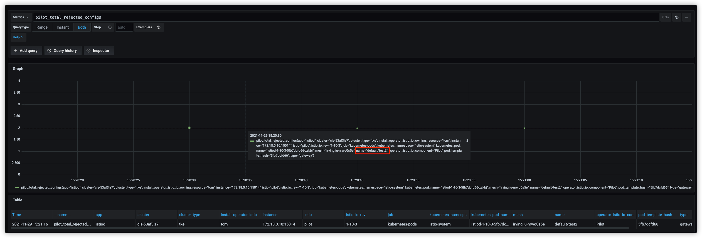

---
title: "Gateway TLS hosts 冲突导致配置被拒绝"
linkTitle: "Gateway TLS hosts 冲突导致配置被拒绝"
weight: 3
date: 2022-07-06
description: 
---

## 故障现象
网格中同时存在以下两个 Gateway
```yaml
apiVersion: networking.istio.io/v1beta1
kind: Gateway
metadata:
  name: test1
spec:
  selector:
    istio: ingressgateway
  servers:
  - hosts:
    - test1.example.com
    port:
      name: https
      number: 443
      protocol: HTTPS
    tls:
      credentialName: example-credential
      mode: SIMPLE
---
apiVersion: networking.istio.io/v1beta1
kind: Gateway
metadata:
  name: test2
spec:
  selector:
    istio: ingressgateway
  servers:
  - hosts:
    - test1.example.com
    - test2.example.com
    port:
      name: https
      number: 443
      protocol: HTTPS
    tls:
      credentialName: example-credential
      mode: SIMPLE
```

172.18.0.6 为 ingress gateway Pod IP，请求 https://test1.example.com 正常返回 404
```bash
curl -i -HHost:test1.example.com --resolve "test1.example.com:443:172.18.0.6" --cacert example.com.crt "https://test1.example.com"
HTTP/2 404
date: Mon, 29 Nov 2021 06:59:26 GMT
server: istio-envoy
```

请求 https://test2.example.com 异常
```bash
$ curl  -HHost:test2.example.com --resolve "test2.example.com:443:172.18.0.6" --cacert example.com.crt "https://test2.example.com"
curl: (35) OpenSSL SSL_connect: Connection reset by peer in connection to test2.example.com:443
```
## 故障原因

通过 istiod 监控发现`pilot_total_rejected_configs`指标异常，显示`default/test2`配置被拒绝

调整 istiod 日志级别查看被拒绝的原因
```
--log_output_level=model:debug
```
```
2021-11-29T07:24:21.703924Z	debug	model	skipping server on gateway default/test2, duplicate host names: [test1.example.com]
```
通过日志定位到具体代码位置
```go
if duplicateHosts := CheckDuplicates(s.Hosts, tlsHostsByPort[resolvedPort]); len(duplicateHosts) != 0 {
    log.Debugf("skipping server on gateway %s, duplicate host names: %v", gatewayName, duplicateHosts)
    RecordRejectedConfig(gatewayName)
    continue
}
```
```go
// CheckDuplicates returns all of the hosts provided that are already known
// If there were no duplicates, all hosts are added to the known hosts.
func CheckDuplicates(hosts []string, knownHosts sets.Set) []string {
	var duplicates []string
	for _, h := range hosts {
		if knownHosts.Contains(h) {
			duplicates = append(duplicates, h)
		}
	}
	// No duplicates found, so we can mark all of these hosts as known
	if len(duplicates) == 0 {
		for _, h := range hosts {
			knownHosts.Insert(h)
		}
	}
	return duplicates
}
```
校验逻辑是每个域名在同一端口上只能配置一次 TLS，我们这里 test1.example.com 在 2 个 Gateway 的 443 端口都配置了 TLS，
导致其中一个被拒绝，通过监控确认被拒绝的是 test2，test2.example.com 和 test1.example.com 配置在 test2 的同一个 Server，Server 配置被拒绝导致请求异常

## 解决方案
同一个域名不要在多个 Gateway 中的同一端口重复配置 TLS，这里我们删除 test1 后请求恢复正常
```bash
$ curl -i -HHost:test1.example.com --resolve "test1.example.com:443:172.18.0.6" --cacert example.com.crt "https://test1.example.com"
HTTP/2 404
date: Mon, 29 Nov 2021 07:43:40 GMT
server: istio-envoy

$ curl -i -HHost:test2.example.com --resolve "test2.example.com:443:172.18.0.6" --cacert example.com.crt "https://test2.example.com"
HTTP/2 404
date: Mon, 29 Nov 2021 07:43:41 GMT
server: istio-envoy
```